# SellPoint — Diagramas de Flujo

> Flujos críticos del sistema en notación Mermaid. Cada diagrama representa la secuencia exacta de pasos entre actores y sistemas.

> **Tip:** los diagramas Mermaid se renderizan automáticamente en GitHub, GitLab, VS Code (con extensión) y herramientas como Notion/Obsidian.

---

## Tabla de Contenidos

1. [Autenticación](#1-autenticación)
2. [Onboarding de Tenant](#2-onboarding-de-tenant)
3. [Gestión de Campos de Catálogo](#3-gestión-de-campos-de-catálogo)
4. [Creación de Producto](#4-creación-de-producto)
5. [Movimientos de Inventario](#5-movimientos-de-inventario)
6. [Venta en POS](#6-venta-en-pos)
7. [Inventario Físico](#7-inventario-físico)
8. [Generación de Reporte](#8-generación-de-reporte)
9. [Multi-Tenancy en Cada Request](#9-multi-tenancy-en-cada-request)

---

## 1. Autenticación

### 1.1 Login + Refresh Token Rotativo

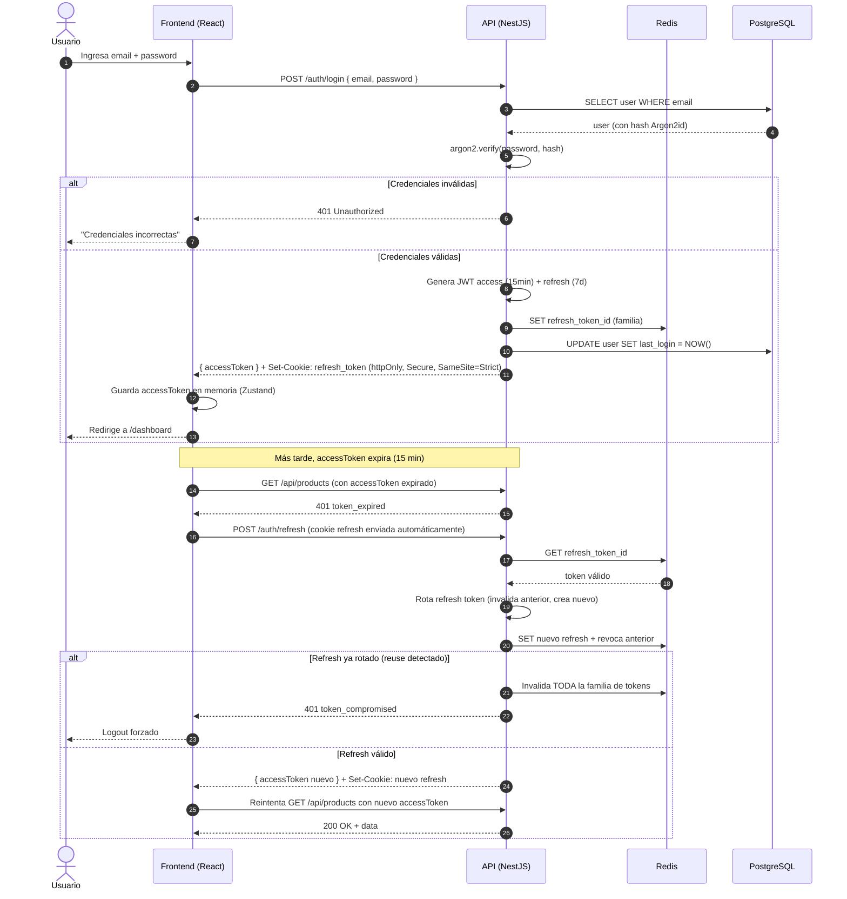

### 1.2 Logout

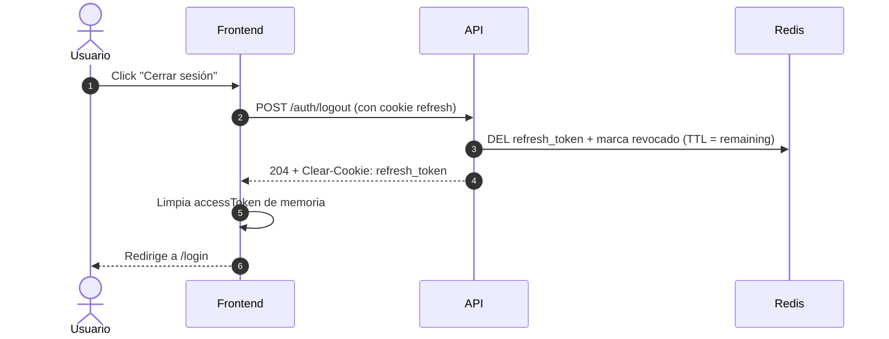

---

## 2. Onboarding de Tenant

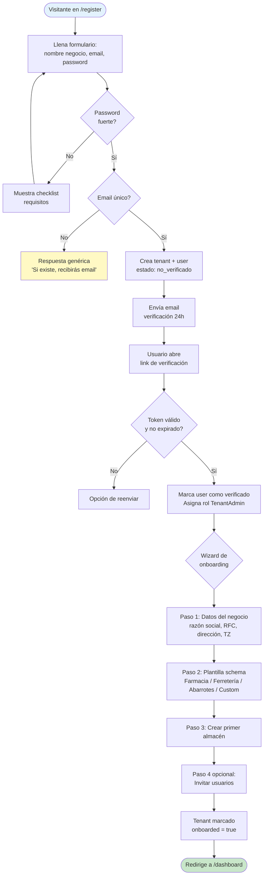

---

## 3. Gestión de Campos de Catálogo

> **Reescrito en la atomización de F2 (2026-08-16):** el flujo previo de versionado
> (publicar v2, migrar/forzar, `schema_drift`, Ajv) quedó **diferido** — decisión de
> Carlos: editor simple con guardas. Ver ARQUITECTURA § 3.3 y CU-CAT-01.

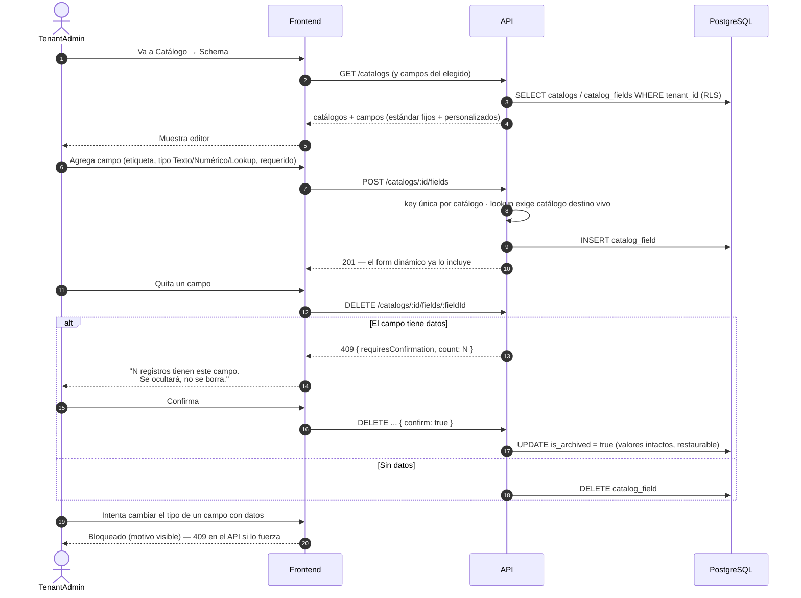

---

## 4. Creación de Producto

```mermaid
flowchart LR
    Start([Manager en<br/>Catálogo → Productos]) --> Click[Click 'Nuevo producto']
    Click --> LoadSchema[Frontend lee los campos<br/>del catálogo de productos]
    LoadSchema --> RenderForm[Renderiza formulario:<br/>campos estándar + dinámicos]
    RenderForm --> Fill[Manager completa campos]
    Fill --> Submit[Submit]
    Submit --> ValidateFront{Validación<br/>frontend Zod}
    ValidateFront -->|Fallo| ShowError1[Marca campos con error]
    ShowError1 --> Fill
    ValidateFront -->|OK| SendAPI[POST /products]

    SendAPI --> ValidateDTO{ZodValidationPipe<br/>DTO en NestJS}
    ValidateDTO -->|Fallo| Return400a[400 Bad Request]
    ValidateDTO -->|OK| LoadSchemaBack[Lee catalog_fields del<br/>catálogo de productos]
    LoadSchemaBack --> ValidateFields{Validador derivado<br/>de los campos}
    ValidateFields -->|Fallo| Return400b[400 con errores<br/>por campo]
    ValidateFields -->|OK| CheckSKU{SKU único<br/>en el tenant?}
    CheckSKU -->|No| Return409[409 Conflict]
    CheckSKU -->|OK| Insert[INSERT product + presentación<br/>base «Unidad ×1» con precio/costo<br/>stock = 0]
    Insert --> AuditLog[Audit log entry]
    AuditLog --> Return201[201 Created]
    Return201 --> SuccessUI[Toast 'Producto creado']
    SuccessUI --> End([Lista actualizada])

    style Start fill:#e3f2fd
    style End fill:#c8e6c9
    style Return400a fill:#ffcdd2
    style Return400b fill:#ffcdd2
    style Return409 fill:#ffcdd2
```

---

## 5. Movimientos de Inventario

### 5.1 Entrada Directa (transacción atómica, cualquier motivo)

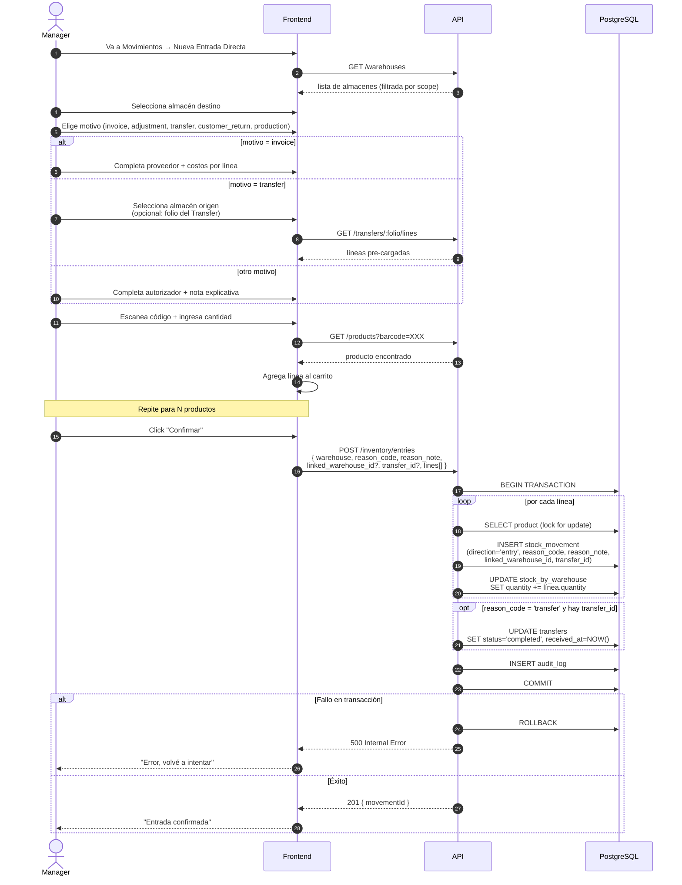

### 5.2 Salida Directa (transacción atómica, cualquier motivo)

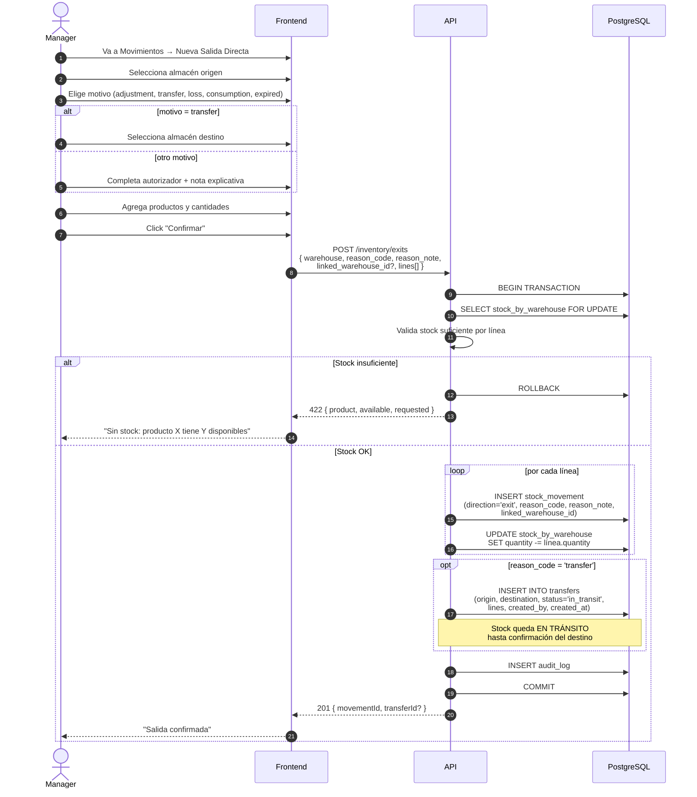

### 5.3 Traspaso entre Almacenes (proceso de 2 pasos con confirmación)

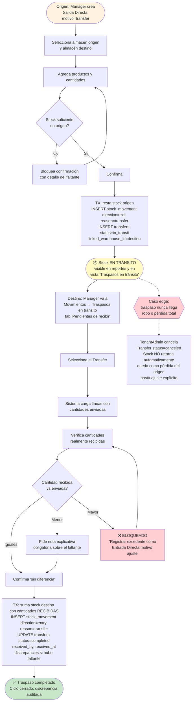

---

## 6. Venta en POS

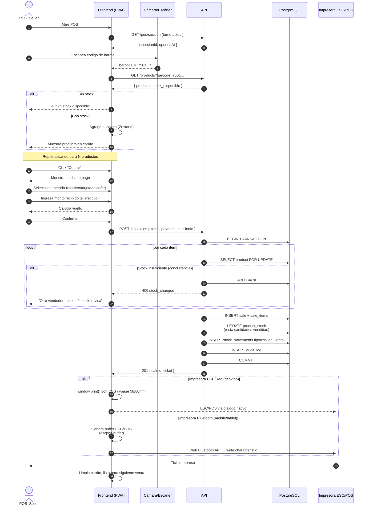

---

## 7. Inventario Físico

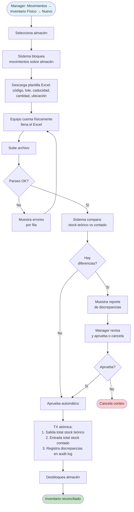

---

## 8. Generación de Reporte

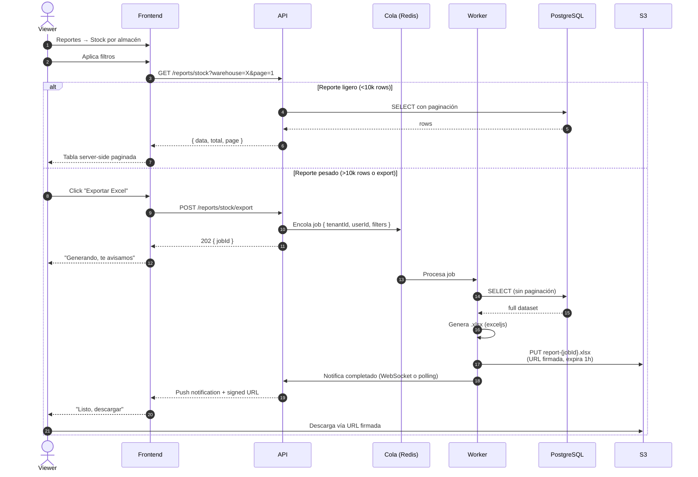

---

## 9. Multi-Tenancy en Cada Request

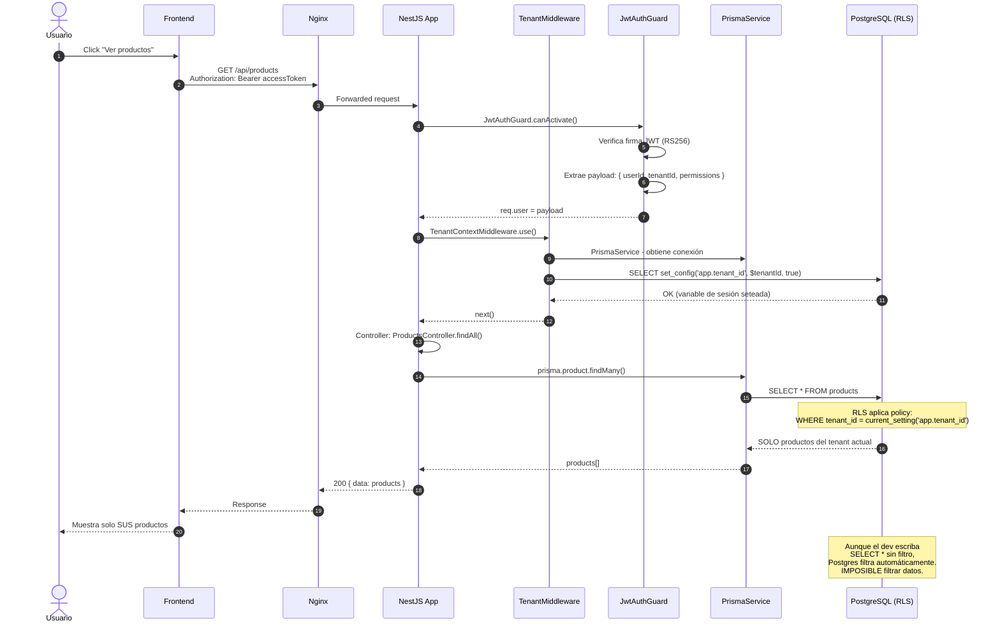

---

*Diagramas Mermaid de SellPoint. Editar este archivo regenera automáticamente las visualizaciones en GitHub y la mayoría de editores.*
